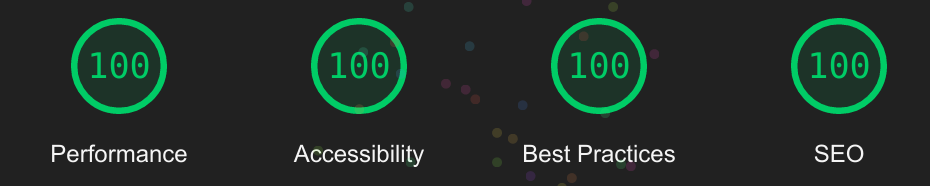

<h1 align="center">
   
  
   
  Frontend Mentor | Intro section with dropdown navigation [ HTML, SCSS, JS ] 
   
</h1>

<h4 align="center">Solution to the Intro section with dropdown navigation challenge on <a href="https://www.frontendmentor.io/challenges/intro-section-with-dropdown-navigation-ryaPetHE5" target="_blank">Frontend Mentor</a>.</h4>

  <a href="#overview">Overview</a> •
  <a href="#links">Links</a> •
  <a href="#built-with">Built with</a> •
  <a href="#author">Author</a>

## Overview

### The challenge

Users should be able to:

- View the relevant dropdown menus on desktop and mobile when interacting with the navigation links
- View the optimal layout for the content depending on their device's screen size
- See hover states for all interactive elements on the page

### What i Learned
- SMACSS Approach
- SCSS
- Accessible Navigation No Js supported.

### Useful resources

- [In Praise of the Unambiguous Click Menu](https://css-tricks.com/in-praise-of-the-unambiguous-click-menu/) - Uses hybrid approach for making accessible dropdowns.
- [A Guide To Accessible Form Validation](https://www.smashingmagazine.com/2023/02/guide-accessible-form-validation/) - Really great guide for creating accessible forms.
- [Solved With Css Dropdown Menus](https://css-tricks.com/solved-with-css-dropdown-menus/) - focus/focus-within supported dropdown menu guide.
- [More Accessible hamburger menu](https://medium.com/codex/building-a-more-accessible-and-simpler-hamburger-menu-f6d681a7e671) - focus/focus-within supported dropdown menu guide.

## Links

- Solution URL: [here](https://github.com/itsdevdeepak/frontendmentor/intro-section-with-dropdown-navigation)
- Live Site URL: [here](https://itsdevdeepak.github.io/frontendmentor/intro-section-with-dropdown-navigation)

## Built with
- Semantic HTML5 markup 
- SCSS frontendmentor/newsletter-sign-up-with-success-message
- Flexbox
- SMACSS 
- Accessibility 

## Author

- Website - [itsdevdeepak.me](https://itsdevdeepak.me)
- Frontend Mentor - [@itsdevdeepak](https://www.frontendmentor.io/profile/itsdevdeepak)
- Twitter - [@itsdevdeepak](https://www.twitter.com/itsdevdeepak)

## Lighthouse Score

    
Lighthouse Score

    

