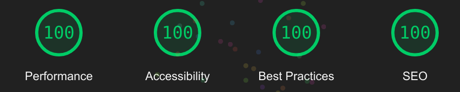

<h1 align="center">
   
  
   
  Frontend Mentor | Newsletter sign-up form with success message [ HTML, SCSS, JS ] 
   
</h1>

<h4 align="center">Solution to the Newsletter sign-up form with success message challenge on <a href="https://www.frontendmentor.io/challenges/newsletter-signup-form-with-success-message-3FC1AZbNrv" target="_blank">Frontend Mentor</a>.</h4>

  <a href="#overview">Overview</a> •
  <a href="#links">Links</a> •
  <a href="#built-with">Built with</a> •
  <a href="#author">Author</a>

## Overview

### The challenge

Users should be able to:

- Add their email and submit the form
- See a success message with their email after successfully submitting the form
- See form validation messages if:
  - The field is left empty
  - The email address is not formatted correctly
- View the optimal layout for the interface depending on their device's screen size
- See hover and focus states for all interactive elements on the page

### What i Learned
- SMACSS Approach
- SCSS
- Accessible form and error handling.

### Useful resources

- [A Guide To Accessible Form Validation](https://www.smashingmagazine.com/2023/02/guide-accessible-form-validation/) - Really great guide for creating accessible forms.
- [Designing Better Error Messages UX](https://www.smashingmagazine.com/2022/08/error-messages-ux-design/) - This one cover for design side of thing.

## Links

- Solution URL: [here](https://github.com/itsdevdeepak/frontendmentor/newsletter-sign-up-with-success-message)
- Live Site URL: [here](https://itsdevdeepak.github.io/frontendmentor/newsletter-sign-up-with-success-message)

## Built with
- Semantic HTML5 markup
- SCSS
- Flexbox
- SMACSS 
- Accessibility

## Author

- Website - [itsdevdeepak.me](https://itsdevdeepak.me)
- Frontend Mentor - [@itsdevdeepak](https://www.frontendmentor.io/profile/itsdevdeepak)
- Twitter - [@itsdevdeepak](https://www.twitter.com/itsdevdeepak)

## Lighthouse Score

    
Toggle Switch

    

